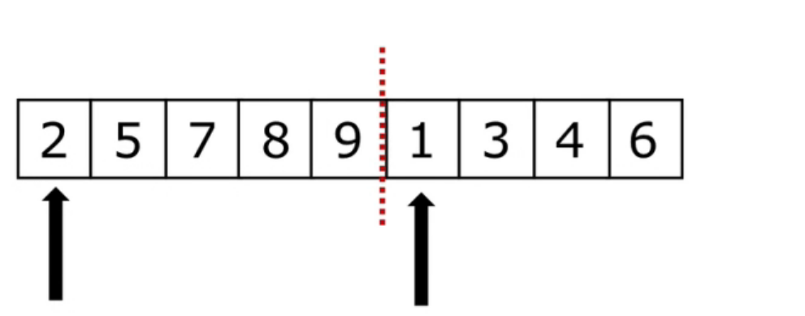

# 算法基础

[TOC]


# 算法概念

算法（`Algorithm`）:一个计算过程，解决问题的办法

`Niklaus Wirth`：“程序=数据结构+算法”


# 时间复杂度

- 时间复杂度是用来估计算法运行时间的一个式子（单位）
- 一般来说，时间复杂度高的算法比复杂度低的算法慢
- 常见的时间复杂度（按效率排序）
    - $O(1) < O(log n) < O(n) <O(n log n)<O(n^2) <O(n^2 log n)<O(n^3)$
- 复杂问题的时间复杂度
    - $O(n!)$  $O(2^n)$  $O(n^n)$  ……
- 快速判断算法复杂度（适用于绝大多数简单情况）
    - 确定问题规模$n$
    - 循环减半过程→$log n$
    - $K$层关于$n$的循环→$n^k$
- 复杂情况：根据算法执行过程判断

# 空间复杂度

- 空间复杂度：用来评估算法内存战役哦那个大小的式子
- 空间复杂度的表示方式与时间复杂度完全一样
    - 算法使用了几个变量：$O(1)$
    - 算法使用了长度为$n$的以为列表$O(1)$
    - 算法使用了$m$行$n$列的二维列表$O(mn)$
- “空间换时间”

# 复习：递归

- 递归的两个特点：

    - 调用自身
    - 结束条件 

- 递归实例：汉诺塔问题

    

    - 大梵天创造世界的时候做了三根金刚石柱子，在一根柱子柱子上从下往上按照大小顺序摞着64片黄金圆盘。

    - 大梵天命令婆罗门把圆盘从下面开始按照大小顺序重新拜访在另一根柱子上。在小圆盘上不能放大圆盘，在三根柱子之间一次只能移动一个圆盘。

        ```python
        def hanoi(n, a, b, c):
            if n > 0:
                hanoi(n - 1, a, c, b)
                print("moving from %s to %s" % (a, c))
                hanoi(n - 1, b, a, c)
        
        
        hanoi(3, "A", "B", "C")
        ```

        

# 查找

- 查找：在一些数据元素中，通过一定的方法找出与给定关键字相同的数据元素的过程。
- 列表查找（线性表查找）：从列表中查找指定元素
    - 输入：列表、待查找元素
    - 输出：元素下标（未找到元素一般返回`None`或`-1`）
- 内置列表查找函数：`index()`

## 顺序查找

- 顺序查找：也叫线性查找，从列表第一个元素开始，顺序进行搜索，直到找到元素或搜索到列表最后一个元素为止。

- 时间复杂度$O(n)$

     ```python
     def linear_search(li: List, val) -> int or None:
         """
         顺序查找
         :param li:需要查找的列表
         :param val: 需要查找的元素
         :return:
         """
         for ind, v in enumerate(li):
             if v == val:
                 return ind
         return
     ```

## 二分查找（Binary Search）

- 二分查找：又叫折半查找，从**有序**列表的初始候选区`li[0:n]`开始,通过对待查找的值与候选区中间值的比较，可以使候选区减少一半。

    ```python
    def binary_search(li: List, val) -> int or None:
        """
        二分查找
        :param li:有序列表
        :param val: 需要查找的元素
        :return:
        """
        left = 0
        right = len(li) - 1
        while left <= right:
            mid = (left + right) // 2
            mid_val = li[mid]
            if mid_val == val:
                return mid
            elif mid_val > val:
                right = mid - 1
            else:
                left = mid + 1
        return
    ```


# 排序

## 什么是列表排序

- 排序：将一组“无序”的记录序列调整为“有序”的记录序列。
- 列表排序：将无序列表变为有序列表
    - 输入：列表
    - 输出：有序列表
- 升序与降序
- 内置排序函数：`sort()`

## 常见排序算法介绍

- 排序$Low \ B$三人组
    - 冒泡排序
    - 选择排序
    - 插入排序
- 排序$NB$三人组
    - 快速排序
    - 堆排序
    - 归并排序
- 其他排序
    - 希尔排序
    - 计数排序
    - 基数排序

## 排序算法分析

### 冒泡排序

- 列表每两个响铃的数，如果前面比后面大，则交换这两个数；

- 一趟排序完成后，则无序区减少一个数，有序区增加一个属；

- 代码关键点：
    躺、无序区范围。

- 代码实现：

    ```python
    def bubble_sort(li: List[int]) -> None:
        """
        冒泡排序
        :param li:无序列表
        :return: None
        """
        n = len(li)
        for i in range(n - 1):
            for j in range(n - i - 1):
                if li[j] > li[j + 1]:
                    li[j], li[j + 1] = li[j + 1], li[j]
    ```

- 时间复杂度：$O(n^2)$

- 代码优化：在某一趟没有发生元素交换，即可结束排序，如下

    ```python
    def bubble_sort(li: List[int]) -> None:
        """
        冒泡排序
        :param li:无序列表
        :return: None
        """
        n = len(li)
        for i in range(n - 1):
            exchange = False
            for j in range(n - i - 1):
                if li[j] > li[j + 1]:
                    li[j], li[j + 1] = li[j + 1], li[j]
                    exchange = True
            if not exchange:
                break
    ```


### 选择排序

- 一趟排序记录最小的数，放到第一个位置
- 再一趟排序记录列表无序区最小的数，放到第二个位置
- ……
- 算法关键点：有序区与无序区，无序区最小数的位置
- 代码实现如下：

```python
def select_sort(li: List) -> None:
    """
    选择排序
    :param li: 无序列表
    :return: None
    """
    n = len(li)
    for i in range(n - 1):
        min_loc = i
        for j in range(i + 1, n):
            if li[j] < li[min_loc]:
                min_loc = j
        li[i], li[min_loc] = li[min_loc], li[i]
```

- 时间复杂度：$O(n^2)$

### 插入排序

- 初始是手里（有序区）只有一张牌

- 每次从无序区摸一张牌，插入到手里已有牌的正确位置

- 代码实现如下：

    ```python
    def insert_sort(li: List) -> None:
        """
        插入排序
        :param li: 无序列表
        :return: None
        """
        n = len(li)
        for i in range(1, n):  # i 表示摸到的牌的下标
            temp = li[i]
            j = i - 1  # 手里的牌的下标
            while li[j] > temp and j >= 0:
                li[j + 1] = li[j]
                j -= 1
            li[j + 1] = temp
    ```

- 时间复杂度：$O(n^2)$

### 快速排序

快速排序：快

快速排序思路：

- 取一个元素$P$（第一个元素），是元素$P$归位；

- 列表被$P$分成两部分，左边都比$P$小，右边都比$P$大；

- 递归完成排序。

    

- 代码实现：

    ```python
    def partition(li: List, left: int, right: int) -> int:
        """
        对分区排序
        :param li:
        :param left:
        :param right:
        :return:
        """
        temp = li[left]
        while left < right:
            while left < right and li[right] >= temp:  # 右边找比temp小的数
                right -= 1  # 往左走一步
            li[left] = li[right]  # 把右边的值写道左边的空位上
            # print(li, "right")
            while left < right and li[left] <= temp:
                left += 1
            li[right] = li[left]
            # print(li, "left")
        li[left] = temp
        return left
    
    
    def _quick_sort(li: List, left: int, right: int) -> None:
        """
        递归P归位
        :param li:
        :param left:
        :param right:
        :return:
        """
        if left < right:  # 至少两个元素
            mid = partition(li, left, right)
            _quick_sort(li, left, mid - 1)
            _quick_sort(li, mid + 1, right)
    
    
    def quick_sort(li: List) -> None:
        """
        快速排序
        :param li:
        :return:
        """
        _quick_sort(li, left=0, right=len(li) - 1)

- 快速排序的时间复杂度：$O(n log n)$

- 快速排序的问题：
    - 最坏情况 ：$O(n^2)$
    - 递归：递归会消耗较多系统资源，递归有最大深度限制

### 树与二叉树

- 树是一种数据结构 
    - 比如：目录结构
- 树是一种可以递归定义的数据结构
- 树是由$n$个节点组成的集合
    - 如果$n=0$，那这是一棵空树
    - 如果$n>0$，那么存在一个节点作为树的根节点，其他节点可以分为$m$个集合，每个结合本身又是一棵树。
- 一些概念：
    - 根节点、叶子节点
    - 树的深度（高度）
    - 树的度（最大节点的度）
    - 孩子节点/父节点
    - 子树
- 满二叉树：
    一个二叉树，如果每一层的节点数都达到最大值，则这个二叉树就是满二叉树
- 完全二叉树：
    叶节点只能出现再最下层和次下层，并且最下面一层的节点都集中在最左边的若凡位置的二叉树
- 二叉树的存储方式（表示方式）
    - 链式存储方式
    - 顺序存储方式（采用）
- 父节点和左孩子节点的编号下标有什么关系
    - $0 \to 1, \ 1 \to 3, \ 2 \to 5, \ 3 \to 7, \ 4 \to 9 \ $
    - $i \to 2i+1$
- 父节点和右孩子节点的编号下标有什么关系
    - $0 \to 2, \ 1 \to 4, \ 2 \to 6, \ 3 \to 8, \ 4 \to 10 \ $
    - $i \to 2i+2$

### 堆排序

- 堆：一种特殊的完全二叉树结构

    - 大根堆：一棵完全二叉树，满足任一节点都比其他孩子节点大
    - 小根堆：一棵完全二叉树，满足任一节点都比其他孩子节点小

- 堆的向下调整性质：

    - 假设根节点的左右子树都是堆，但是根节点不满足堆的性质
    - 可以通过一次向下调整来将其变成一个堆

- 堆排序过程：

    1. 建立堆；
    2. 得到堆顶元素，为最大元素；
    3. 去掉堆顶，将堆最后一个元素放到堆顶，此时可通过一次调整重新使堆有序；
    4. 堆顶元素为第二大元素；
    5. 重复步骤$3-4$，直到堆顶变空；

- 代码实现:

    ```python
    import random
    from typing import List
    
    
    def sift(li: List, low: int, high: int) -> None:
        """
        向下调整
        :param li: 列表
        :param low: 堆的堆顶位置（根节点位置）
        :param high: 堆的最后一个元素的位置（用于查找最后一个非叶子节点）
        :return: None
        """
        i = low  # 最开始指向根节点
        j = i * 2 + 1  # j开始使左孩子
        temp = li[low]  # 把堆顶存起来
        while j <= high:  # 只要j位置有数（没有越界）
            if j + 1 <= high and li[j + 1] > li[j]:  # 右节点存在且比左节点大
                j += 1
            if li[j] > temp:
                li[i] = li[j]
                i = j  # 往下走一层，更新i,j
                j = 2 * i + 1
            else:  # temp更大，把temp放到i的位置
                li[i] = temp
                break
        else:
            li[i] = temp  # 把temp放到叶子节点上
    
    
    def heap_sort(li: List) -> None:
        n = len(li)
        # 建堆
        for i in range((n - 2) // 2, -1, -1):
            sift(li, low=i, high=n - 1)
        # 建堆完成
        # 逐个出数
        for i in range(n - 1, -1, -1):
            # i指向堆的最后一个元素
            li[0], li[i] = li[i], li[0]
            sift(li, low=0, high=i - 1)
    ```

- 时间复杂度：$O(nlogn)$

- $Python$内置模块：`heapq`

- 常用函数

    - `heapify(x)`
    - `heappush(heap,item)`
    - `heappop(heap)`

- $topk$问题

    - 现在有$n$个数，设计算法得到前K大的数。$(k<n)$
    - 解决方法：
        - 排序后切片，$O(nlogn)$
        - 排序$Low \ B$三人组，$ O(mn)$
        - 堆排序思路 ， $O(mlongn)$
    - 解决思路（堆排序思路）：
        1. 取列表前K个元素建立一个小根堆。堆顶就是目前第k大的数；
        2. 依次向后遍历原列表，对于列表中的元素，如果小于堆顶，则忽略该元素；如果大于堆顶，则将堆顶更换为该元素，并且对堆进行一次调整；
        3. 遍历列表所有元素后，倒叙弹出堆顶。

### 归并排序

- 归并

    - 假设现在的列表分两段有序，如何将其合并成为一个有序列表

    

    - 这种操作成为一次归并

- 过程：

    - 分解：将列表越分越小，直至分成一个元素；

    - 终止条件：一个元素是有序的；

    - 合并：将两个有序列表归并，列表越来越大。

     ```python
        def merge(li: List, low: int, mid: int, high: int) -> None:
            """
            归并
            :param li:
            :param low:
            :param mid:
            :param high:
            :return:
            """
        
            i = low
            j = mid + 1
            temp_list = []
            while i <= mid and j <= high:  # 只要左右两边都有数
                if li[i] < li[j]:
                    temp_list.append(li[i])
                    i += 1
                else:
                    temp_list.append(li[j])
                    j += 1
            # while 执行完，肯定有一部分没数了
            while i <= mid:
                temp_list.append(li[i])
                i += 1
            while j <= high:
                temp_list.append(li[j])
                j += 1
            li[low: high + 1] = temp_list
        
        
        def _merge_sort(li: List, low: int, high: int) -> None:
            """
            :param li:
            :param low:
            :param high:
            :return: None
            """
            if low < high:  # 至少有两个元素，递归：
                mid = (low + high) // 2
                _merge_sort(li, low, mid)
                _merge_sort(li, mid + 1, high)
                merge(li, low, mid, high)
        
        
        def merge_sort(li: List):
            """
            递归排序
            :param li:
            :return:
            """
            _merge_sort(li, 0, len(li) - 1)
     ```


- 时间复杂度：$O(nlogn)$
- 空间复杂度：$O(n)$

### NB三人组小结

- 三种算法的时间复杂度都是O(nlogn)

- 一般情况下，就运行时间而言：

    - 快速排序$<$归并排序$<$堆排序

- 三种算法的优缺点：

    - 快速排序：极端情况下排序效率低

    - 对并排序：需要额外的存储开销

    - 堆排序：在快的排序算法中相对较慢

        

### 希尔排序

- 希尔排序（$Sheel \ Sort$）是一种分组插入排序算法

    - 首先去一个整数$d_1=\frac n 2$，将元素分为$d_1$个组，每组相邻元素之间距离为$d_1$，在各组内进行直接插入排序；
    - 取第二个整数$d_2=\frac {d_1}{2}$，重复上述分组排序过程，直到$d_i=1$，即所有元素在同一组内进行直接插入排序。

- 希尔排序每趟并不是某些元素有序，而是使整体数据越来越接近有序，最后一趟使得所有数据有序。

- 代码试下如下

    ```python
    from typing import List
    
    
    def insert_sort_gap(li: List, gap) -> None:
        """
        插入排序(修改后)
        :param li: 无序列表
        :return: None
        """
        n = len(li)
        for i in range(gap, n):  # i 表示摸到的牌的下标
            temp = li[i]
            j = i - gap  # 手里的牌的下标
            while li[j] > temp and j >= 0:
                li[j + gap] = li[j]
                j -= gap
            li[j + gap] = temp
    
    
    def shell_sort(li: List) -> None:
        """
        希尔排序
        :param li: 无序列表
        :return:  None
        """
        d = len(li) // 2
        while d >= 1:
            insert_sort_gap(li, d)
            d //= 2
    ```

    

- 希尔排序得时间复杂度比较复杂，而且和选取的gap序列有关。

### 计数排序

- 对列表进行排序，已知列表中的数范围都在$0-100$之间。设计时间复杂度为$O(n)$的算法。

- 代码实现如下：

    ```python
    from typing import List
    
    
    
    def count_sort(li: List[int], max_count: int = 100) -> None:
        count = [0 for _ in range(max_count + 1)]
        for val in li:
            count[val] += 1
        li.clear()
        for ind, val in enumerate(count):
            for i in range(val):
                li.append(ind)
    ```

### 桶排序

- 在计数排序中，如果元素范围比较大（比如在1到1亿之间），如何改造算法？

- 桶排序(Bucket Sort)：首先将元素分在不同的桶内，在对每个桶 中的元素排序。

- 代码实现如下：

    ```python
    from typing import List
    
    
    def bucket_sort(li: List, n: int = 100, max_num: int = 10000) -> None:
        buckets = [[] for _ in range(n)]
        # 把元素放到不同桶里
        for val in li:
            # 0->0,86->0,100-1,
            i = min(val // (max_num // n), n - 1)  # i表示val放到几号桶
            buckets[i].append(val)
            # 对每个桶排序，保持桶内的顺序
            for j in range(len(buckets[i]) - 1, 0, -1):
                if buckets[i][j] < buckets[i][j - 1]:
                    buckets[i][j], buckets[i][j - 1] = buckets[i][j - 1], buckets[i][j]
                else:
                    break
        li.clear()
        for buc in buckets:
            li += buc
    ```

- 桶排序的表现取决于数据的分布。也就是需要对不同数据排序时采取不同的粪桶策略。

- 平均情况时间复杂度：$O(n+k)$

- 最坏情况时间复杂度：$O(n^2k)$

- 空间复杂度：$O(nk)$

### 基数排序

- 多关键字排序：加入现有一个员工表要求按照薪资排序，年龄相同的员工按照年龄排序

    - 先按照年龄进行排序，再按照信息进行稳定的排序

- 对$32,13,94,52,17,54,93$排序，是否可以看做是多关键字排序？

- 代码实现如下：

    ```python
    from typing import List
    
    def radix_sort(li: List) -> None:
        """
        基数排序
        :param li: 无序列表
        :return:None
        """
        max_num = max(li)  # 最大值
        it = 0
        while 10 ** it <= max_num:
            buckets = [[] for _ in range(10)]
            for val in li:
                digit = (val // 10 ** it) % 10
                buckets[digit].append(val)
            li.clear()
            for buc in buckets:
                li.extend(buc)
            it += 1
    ```

- 时间复杂度：$O(kn)$

- 空间复杂度：$O(k+n)$

- $k$表示数字位数
