# 数据结构

[TOC]

- 数据结构是指相互之间存在着一种或多种关系的数据元素的集合和该集合中数据元素之间的关系组成。
- 简单来说，数据结构就是设计数据以任何方式组织并存储再计算机中。
- 比如：列表、集合与字典等都是一种数据结构。
- `N.Wirth`：”$程序=数据结构+算法$“

- 数据结构按照其逻辑结构可分为线性结构、树结构、图结构
    - 线性结构：数据结构中元素存在一对一的相互关系
    - 树结构：数据结构中红的元素存在一对多的相互关系
    - 图结构：数据结构中的元素存在多对多的相互关系

# 栈

- 栈$(Stack)$是一个数据集合，可以理解为只能在一端进行插入后者删除操作的列表。
- 栈的特点：先进后出$\ LIFO \ (last-in,\ first-out)$
- 栈的概念：栈顶，栈底
- 栈的基本操作：
    - 进栈(压栈)：`push`
    - 出栈：`pop`
    - 取栈顶：`gettop`
- 使用一般的列表结构杰克实现栈：
    - 进栈(压栈)：`li.append()`
    - 出栈：`li.pop()`
    - 取栈顶：`li[-1]`
- 栈的应用——括号匹配问题
    - 括号匹配问题：给一个字符串，其中包括小括号、中括号、大括号，求该字符串中的括号是否匹配。
    - 例如：
        - ()(){}				匹配
        - ([{()}])			匹配
        - [](		 		不匹配
        - [(])				不匹配

# 队列

- 队列$(Queue)$是一个数据集合，仅允许在列表的一段进行插入，另一端进行删除。

- 进行插入的一端称为队尾$(rear)$，插入动作称为进队或者入队

- 进行删除的一端称为队头$(front)$，删除动作称为出队

- 队列的性质：先进先出$(First-in,First-out)$

    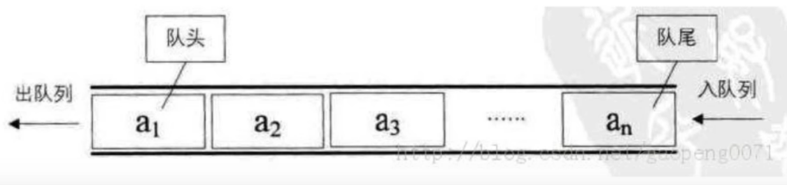

- 队列的实现方式

## 环形队列

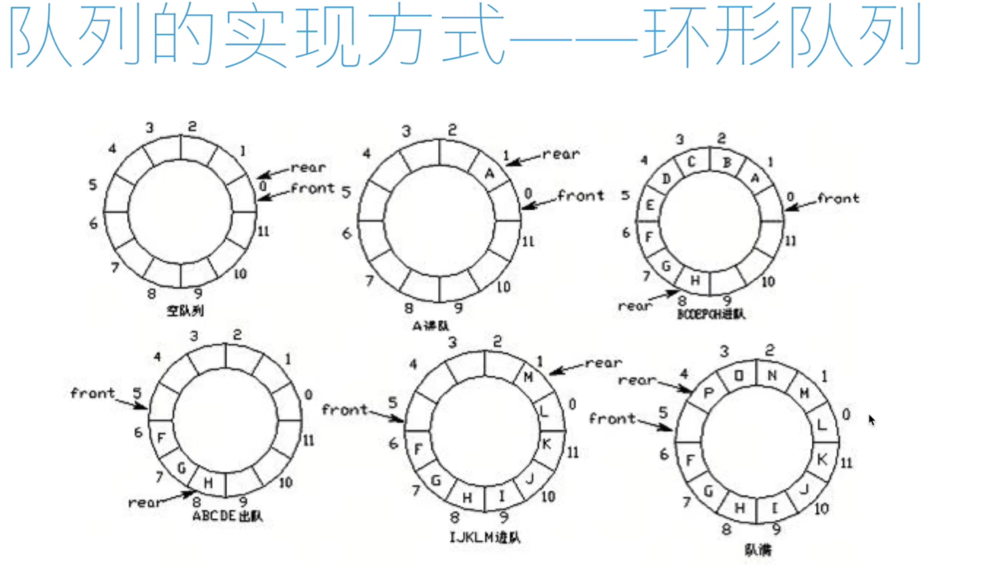

- 环形队列：当队尾指针`front==Maxsize + 1`时，再前进一个位置就自动到0.
    - 队首指针前进1：`front = (front + 1) % Maxsize`
    - 队尾指针前进1：`rear = (rear+ 1) % Maxsize`
    - 队空条件：`rear == front`
    - 队满条件：`(rear + 1) % Maxsize ==front`

## 双向队列

- 双向队列的两端都支持进队和出队操作

- 双向队列的基本操作：

    - 队首进队
    - 队首出队
    - 队尾进队
    - 队尾出
    

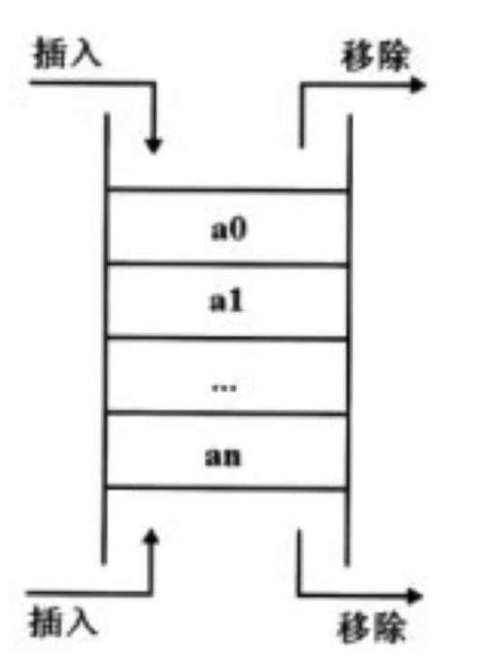

## Python队列内置模块

- 使用方法：`from collections import deque`
    - 创建队列：`queue = deque()`
    - 进队：`append()`
    - 出队：`popleft()`
    - 双向队列队首进队：`appendleft()`
    - 双向队列队尾出队：`pop()`

# 栈和队列的应用——迷宫问题

- 给一个二维列表，表示迷宫（0表示通道，1表示围墙）。位处算法，求一条走出迷宫的路径。

    

**栈——深度优先搜索**

- 回溯法
- 思路：从一个节点开始，任意找下一个能走的点，当找不到能走的点时，退回上一个点寻找是否有其他方向的点。
- 使用栈存储当前路径

# 链表

链表是由一系列节点组成得元素集合。每个节点包括两部分，数据域item和只想下一个节点的指针next。通过节点之间的想好好连接，最终串联成一个链表。

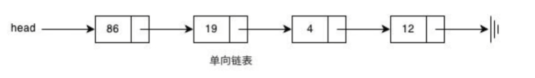

链表类

```python
class Node:
    def __init__(self, item, next=None):
        self.item = item
        self.next = next
```

## 创建链表

- 头插法


```python
def create_linklist_head(li: List[int]) -> Node:
    """
    头插法
    :param li:
    :return:
    """
    if not li:
        return Node(None)
    head = Node(li[0])
    for element in li[1:]:
        node = Node(element)
        node.next = head
        head = node
    return head
```

- 尾插法

  ```python
  def create_linklist_tail(li: List[int]) -> Node:
      """
      尾插法
      :param li:
      :return:
      """
      if not li:
          return Node(None)
      head = Node(li[0])
      tail = head
      for element in li[1:]:
          node = Node(element)
          tail.next = node
          tail = node
      return head
  ```

## 链表节点的插入

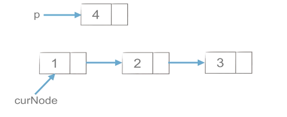

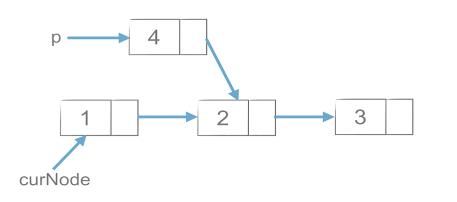

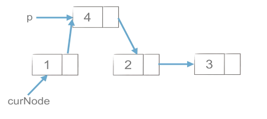


```python
p.next = cur_node.next
cur_node.next=p
```

## 链表节点的插入


```python
p = cur_node.next
cur_node.next = cur_node.next.next
del p
```

# 双链表

**双链表的每个节点有两个指针：一个指向后一个节点，另一个指向前一个节点。**

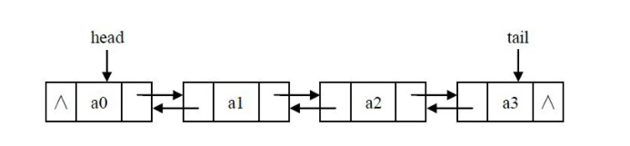

## 双链表节点的插入

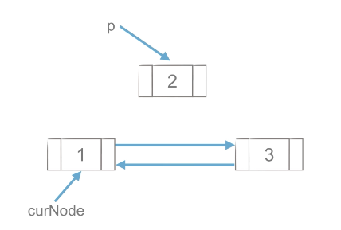

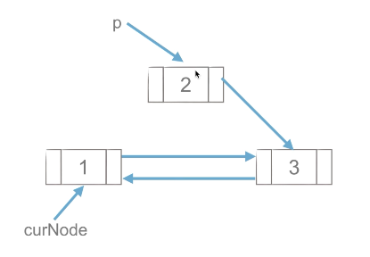

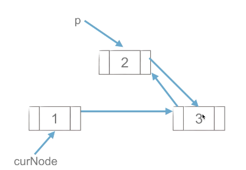

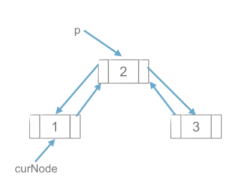


```python
p.next = cur_node.next
cur_node.next.prior = p
p.prior = cur_node
cur_node.next = p
```

## 双链表节点的删除

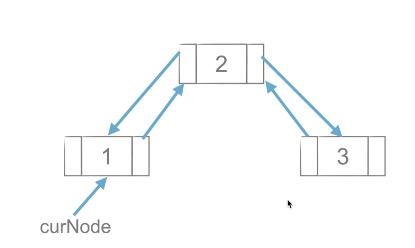

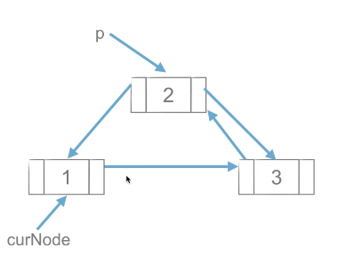

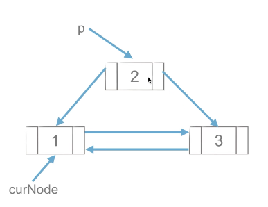


```python
p = cur_node.next
cur_node.next = p.next
p.next,prior = cur_node
del p
```

# 链表——复杂度分析

- 顺序表（列表/数组）与链表

  |                | 顺序表 | 链表 |
  | -------------- | ------ | ---- |
  | 按元素值查找   | O(n)   | O(n) |
  | 按下标查找     | O(1)   | O(n) |
  | 在某元素后插入 | O(n)   | O(1) |
  | 删除某元素     | O(n)   | O(1) |

- 链表在插入和删除的操作上明显快于顺序表

- 链表的内存可以更灵活的分配

  - 试利用链表重新实现栈和队列

- 链表这种链式存储的数据结构对树和图的结构有很大的启发性

# 哈希表

- 哈希表是一个通过哈希函数来计算数据存储位置的数据结构，通常支持如下操作：
  - `insert(key, value)`：插入键值对(key, value)
  - `get(key)`：如果存在键为key的键值对则返回其value，否则返回空值
  - `delete(key)`：删除键为key的键值对

## 直接寻址表

当关键字的全域U比较小时，直接寻址是一种简单有效的方法

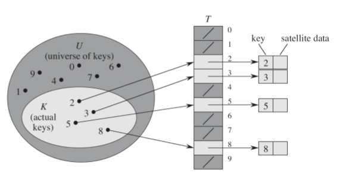

- 直接寻址技术缺点
  - 当域$U$很大时，需要消耗大量内存，很不实际
  - 如果域$U$很大而世界出现的key很少，则大量空间被浪费
  - 无法处理关键字不是数字的情况

## 哈希

- 直接寻址表：key为k的元素放到k位置上
- 改进直接寻址表：哈希($Hashing$)
  - 构建大小为m的寻址表T
  - key为k的元素放到h(k)位置上
  - $h(k)$是一个函数，其将域U映射到表$T[0,1,...,m-1]$

## 哈希表

- 哈希表（$Hash Table$，又称为散列表），是一种线性表的存储结构。哈希表由一个直接寻址表和一个哈希函数组成。哈希函数h(k)将元素关键字k作为自变量，返回元素的存储下标。

- 假设有一个长度为7的哈希表，哈希函数 `h(k) = k % 7`。元素集合`{14, 22, 3, 5}`的存储方式如下图：

  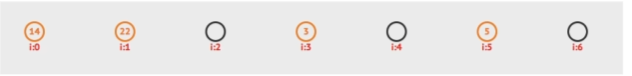

## 哈希冲突

- 由于哈希表的大小是有限的，而要存储的值的总是量是无限的，因此对于任何哈希函数，都会出现两个不同元素映射到同一个位置上的情况，这种情况叫做哈希冲突。
- 比如` h(k) = k % 7 `, `h(0)=h(7)=...`
  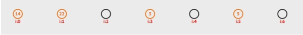

## 解决哈希冲突——开放寻址法

- **开放寻址法：**
  如果哈希函数返回的位置已经有值，则可以向后探查新的位置来存储这个值。

- **线性探查：**
  如果位置i被占用，则探查$i+1,i+2,...$

- **二次探查：**
  如果位置i被占用，则探查$i+1^2$, $i-i^2, i+i^2, 2-i^2$,……

- **二度哈希：**
  有n个哈希函数，当使用第1个哈希函数$h1$发生冲突时，则尝试使用$h2,h3,……$

  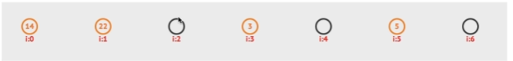


## 解决哈希冲突——拉链法

- 拉链法：哈希表每个位置都连接一个链表，当冲突发生时，冲突的元素将被加到该位置链表的最后。

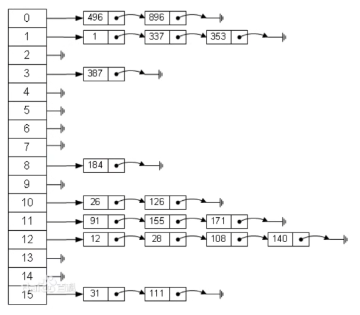

## 常见哈希函数

- 除法哈希法：
  - `h(k) = k % m`
- 乘法哈希法
  - `h(k) = foor(m * (A *key % 1))`
- 全域哈希法
  - $h_{a,b}$`(k) = ((a * key +b) mod p) mod m `a,b = 1,2,3,...,p-1
  - 

## 哈希表的应用——集合与字典

- 字典与集合都是通过哈希表来实现的。
  - `a = { 'name': 'Alex,''age':18,'gender':'Man'}`
- 使用哈希表存储字典，通过哈希函数将字典的键映射为下标。假设h('name') = 3, h('age') = 1, h('gender') = 4,则哈希表存储为[None,18,None,'Alex','Man']
- 如果发生哈希冲突，则通过拉链法或开放寻址法解决

## 哈希表的应用——md5算法

- MD5($Message-Digest Algorithm 5$)**曾经**是密码学中常用的哈希函数，可以把任意长度的数据映射为128为的哈希值，其曾经特征包含如下特征：
  1. 同样的消息，其MD5值必定相同；
  2. 可以快速计算出任意给定消息的MD5值；
  3. 除非暴力的枚举所有可能消息，否则不能从哈希值推出消息本身；
  4. 两条消息之间即使只有微小的差别，其对应的MD5值也应该是完全不同、完全不相关的；
  5. 不能再有意义的时间内人工构造两个不同的消息，时期具有相同的MD5值。
- 应用举例：文件的哈希值
  算出文件的哈希值，若两个文件的哈希值相同，则可认为这两个文件是相同的。因此：
  1. 用户可以利用它来验证下载文件是否完整
  2. 云存储服务商可以利用它来判断用户上传的文件是否已经存在服务器上，从而实现妙传的功能，同时避免存储过多相同的文件副本

## 哈希表的应用——SHA2算法

- 历史上MD5和SHA-1曾经是使用最为广泛的cryptographic hash function，但是随着密码学的发展，这两个哈希函数安全性相继收到各种挑战
- 因此现在安全性较重要的场合推荐使用SHA-2等新的更安全的哈希函数。
- SHA-2包含了一系列的哈希函数：SHA-224,SHA-256,SHA-384,SHA-512,SHA-512/224,SHA-512/256,其对应的哈希值长度分别为224，256，384 ，512位
- SHA-2具有和MD5类似的性质。
- 应用举例，例如
  在比特币系统中，所有参与者需要共同解决如下问题：对于一个给定的字符串U，给定的目标哈希值H，需要计算出一个字符串V，使得U+V的哈希值与H的差小于一个给定值D。此时，只能通过暴力枚举V来进行猜测。首先计算结果的人可以获得一定奖金。而某人首先计算成功的概率与其拥有的计算量成正比，所以其获得的奖金期望值与其拥有的计算量成正比。

# 树与二叉树

## 树

- 树是一种数据结构，比如：文件目录
- 树是一种可以递归定义的数据结构
- 树是由n个节点组成的集合
  - 如果n=0，那这是一棵3空树；
  - 如果n>0,那存在1个节点作为树的根节点，其它节点可以分为m个集合，每个集合本身又是一棵树。

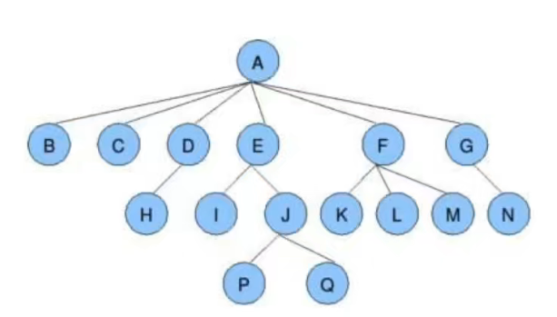

- 一些概念
  - 根节点、叶子节点
  - 树的深度（高度）
  - 树的度
  - 孩子节点/父节点
  - 子树

## 二叉树

- 二叉树得链式存储：
  将二叉树得节点定义为一个对象，节点之间通过类似链表得链接方式来链接。

- 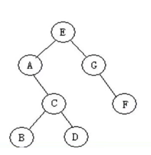

- 节点的定义

  ```python
  class BiTreeNode:
      """二叉树"""
  
      def __init__(self, data):
          self.data = data
          self.left_child = None
          self.right_child = None
  
      def __str__(self):
          return self.data
  ```

- 创建二叉树

```python
a = BiTreeNode("A")
b = BiTreeNode("B")
c = BiTreeNode("C")
d = BiTreeNode("D")
e = BiTreeNode("E")
f = BiTreeNode("F")
g = BiTreeNode("G")

e.left_child = a
e.right_child = g
a.right_child = c
c.left_child = b
c.right_child = d
g.right_child = f

root = e
```


- 二叉树得遍历方式

  - 前序遍历：EACBDGF

  ```python
  # 前序遍历
  def pre_order(root: BiTreeNode):
      if root:
          print(root.data, end=",")
          pre_order(root.left_child)
          pre_order(root.right_child)
  ```

  

  - 中序遍历：ABCDEGF

  ```python
  # 中序遍历
  def in_order(root: BiTreeNode):
      if root:
          in_order(root.left_child)
          print(root.data, end=",")
          in_order(root.right_child)
  ```

  

  - 后续遍历：BDCAFGE

  ```python
  
  # 后续遍历
  def post_order(root: BiTreeNode):
      if root:
          post_order(root.left_child)
          post_order(root.right_child)
          print(root.data, end=",")
  ```

  

  - 层次遍历：EAGCFBD

  ```python
  # 层次遍历
  def level_order(root: BiTreeNode):
      queue = deque()
      queue.append(root)
      while len((queue)) > 0:
          node = queue.popleft()
          print(node.data, end=',')
          if node.left_child:
              queue.append(node.left_child)
          if node.right_child:
              queue.append(node.right_child)
  ```

  

## 二叉搜索树

- 二叉搜索树是一颗二叉树且满足性质：设x是二叉树的一个节点。如果y是左子树的一个节点，那么y.key $\leq$ x.key；如果y是x右子树的一个节点，那么.key $\geq$ x.key。

- 二叉搜索树的操作：查询、插入、删除。

  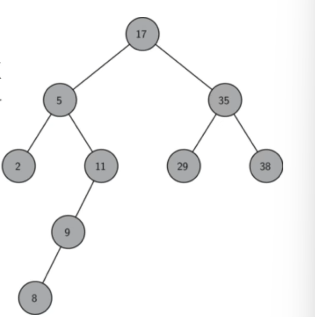

  

  

  
